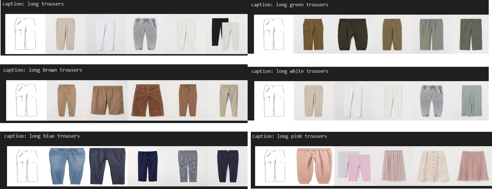
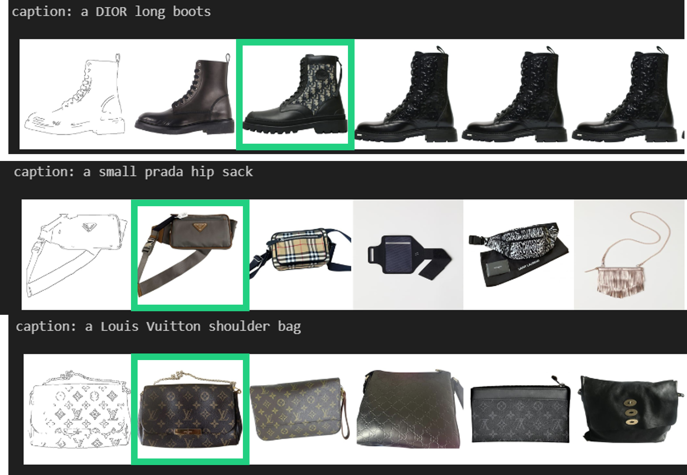
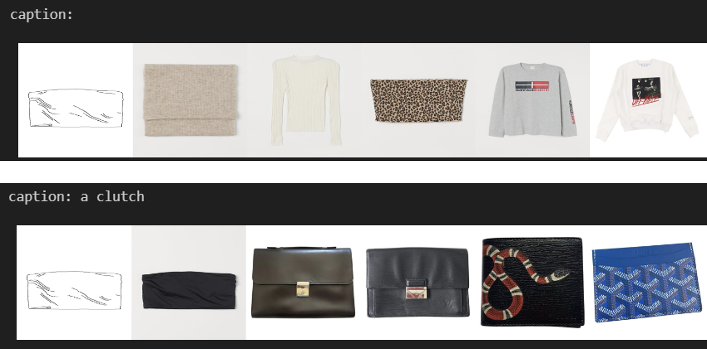
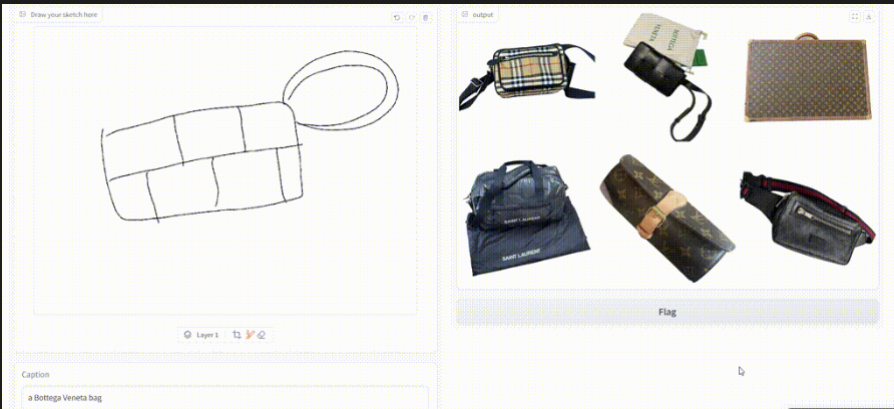

# Fashion SBIR
> 🏆 **2024 AIKU Conference Best Award Winner!** \\
> This project was conducted as part of the AIKU activities during the 2024 summer semester.

This project introduces a **Sketch-Based Image Retrieval (SBIR)** system, designed to enhance fashion search by incorporating both **user-drawn sketches** and **text-based queries**. Traditional search methods, relying solely on text or images, often fall short when users struggle to accurately describe or identify specific styles, colors, or items. By integrating sketch input and natural language descriptions, this system provides a more intuitive and efficient way to retrieve desired fashion items, bridging the gap between visual perception and textual expression.

## Method
Our goal is to **retrieve fashion items** using a combination of sketches and text inputs with an SBIR approach.


### ▶️ Dataset Construction

We built a triplet dataset consisting of **image-sketch-text pairs**. To generate sketches, we used **Canny edge** along with various post-processing techniques to create sketch images that align perfectly with their corresponding fashion images.

A challenge we faced was extracting clear edge maps for **white-colored items** due to the white background in the original images. To address this issue, we applied additional post-processing methods for images containing descriptive text with words like "white, bright, light, pale, ivory, cream, sky, gray." Specifically, **CLAHE** and **histogram equalization** techniques were employed to enhance edge visibility.

### ▶️ Modeling

We leveraged **CLIP's vision and text encoders** to obtain embeddings for images, sketches, and text. We mixed the sketch and text embeddings, then aligned them with the image embeddings through **contrastive learning** for metric learning.

- **Shared Vision Encoder**: A shared encoder is used for both images and sketches.
- **Embedding Fusion**: We fuse sketch and text embeddings using methods such as averaging or concatenation.
- **Loss Function**: We employed **InfoNCE loss** to align the image embeddings with the combined sketch and text embeddings.

## Environment Setup

Prerequisites:
- Pytorch
- ftfy

You can easily set up the environment using the provided environment.yaml file:
``` 
conda env create -f environment.yaml
conda activate fashion_sketch
```
  
## How to Use

To train and test the model, execute the main.ipynb file.
To run the demo, use the following command:
```
python demo.py
```

## Example Results
### 1. Retrieving an Image with an Edge Map and Text Caption

Providing an edge map along with a text caption helps the model retrieve the most relevant image first, with other results also showing high relevance.

### 2. Effect of Color Variations

Given the sketch of a long trouser, the model retrieves the relevant images. Adding color-specific text descriptions (e.g., "a long red trouser") allows the model to find trousers that match the specified color.

### 3. Incorporating Brand Names in Text Queries

Since some datasets contain luxury brand names, we tested the effect of including brand names in text captions. The model successfully retrieves images corresponding to the mentioned brand. For example, when queried with "Louis Vuitton," the results prominently feature items with recognizable patterns associated with the brand.

### 4. Comparison: With vs. Without Captions

We tested how the presence of captions impacts the search results. Given the same clutch bag sketch, one query included a caption ("a clutch") while the other left it blank. Without the caption, the model struggled to retrieve similar bags, but with the caption, it retrieved clutch bags or similar items more accurately.

### 5. Demo

We created a demo to test the model’s performance with human-drawn sketches. Below is an example where a hand-drawn sketch of a Bottega Veneta bag was used, and the model successfully retrieved relevant images.

## Team Members
- [Jung Hyemin*](https://github.com/hmin27) : Modeling, code implementation, idea proposal
- [Seo Yeonwoo](https://github.com/readygetset) : Model training, demo creation
- [Lee Minha](https://github.com/mlnha) : Dataset construction
